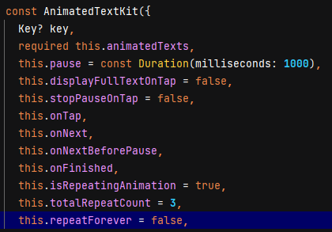

# animated_text_kit_flutter_package

A new Flutter project.

## Getting Started

This project is a starting point for a Flutter application.

A few resources to get you started if this is your first Flutter project:

- [Lab: Write your first Flutter app](https://docs.flutter.dev/get-started/codelab)
- [Cookbook: Useful Flutter samples](https://docs.flutter.dev/cookbook)

For help getting started with Flutter development, view the
[online documentation](https://docs.flutter.dev/), which offers tutorials,
samples, guidance on mobile development, and a full API reference.

## 1. Research: Animated Text Kit Flutter Package

- Keywords:
    - animated text kit flutter package
    - Best animated text kit flutter package
    - animated text style flutter
    - Animated text kit flutter package github
    - flutter animated text color
    - Animated text kit flutter package example
    - Animated text kit flutter package download
    - flutter text slide animation
    - Best animated text kit flutter package free
    - animated text style flutter example
    - fade in text flutter
    - flutter animate text change
    - flutter sliding text
    - flutter animate background color
    - animated text kit flutter
    - animated default text style flutter
    - animated text kit

- Video Title: Animated Text Kit Flutter Package | Animated Text Kit with Default Text Style,
  Sliding Text Examples

## 2. Research: Competitors

**Flutter Videos/Articles**

- 122K: https://youtu.be/foQTKCQqVWk
- 1.1K: https://youtu.be/phFHrani6Y0
- 8.7K: https://youtu.be/HVXpn4n0nfE
- 6.7K: https://youtu.be/RjL5At5xMIs
- 966: https://youtu.be/XjSIMpNmZDE
- 1.7K: https://youtu.be/JmxqX48ChXU
- 1.7K: https://youtu.be/Eor5vSXImP8
- https://pub.dev/packages/animated_text_kit
- https://medium.flutterdevs.com/exploring-text-animations-in-flutter-9b74103940d2
- https://www.geeksforgeeks.org/animated-text-in-flutter/
- https://morioh.com/p/bd02e68d0861
- https://morioh.com/p/147abf075654
- https://anthonywhitford.com/projects/contributions/animated-text-kit/
- https://programmerspouch.medium.com/make-your-flutter-app-more-beautiful-with-animated-text-kit-2f122e558bb1

**Android/Swift/React Videos**

- 63K: https://youtu.be/otMSB-dFuY8?list=PLrnPJCHvNZuARS1W7qMt-zxBNqWYZpOg6
- 4.7K: https://youtu.be/PuZnBP5zCPc
- 45K: https://youtu.be/n7XTizCon0A
- 34K: https://youtu.be/_P_Z5wIxGOc
- 17K: https://youtu.be/fVehE3Jf7K0
- 14K: https://youtu.be/Xv2N0zJkuS0
- 31K: https://youtu.be/pDJJI6bfK1k
- 18K: https://youtu.be/xrEdTtkGnXM
- 26K: https://youtu.be/hTmkjdKO3_M?list=PLQocKVqyqZDSCyzTX6QYZ5k5GBv4_TvAX
- 44K: https://youtu.be/dXVgb3igGJ4?list=PLYxzS__5yYQmdfEyKDrlG5E0F0u7_iIUo
- 817K: https://youtu.be/T33NN_pPeNI
- 67K: https://youtu.be/LP6zmnMcHR0?list=PLy9JCsy2u97k6olfalMTA_XSPz4pNuT46
- 60K: https://youtu.be/yz9E10Dq8Bg?list=PLjHsmVtnAr9TWoMAh-3QMiP7bPUqPFuFZ
- 12K: https://youtu.be/ffMQ_R2Q9pk
- 84K: https://youtu.be/yV-2HRzNX9o
- https://developer.android.com/reference/android/animation/package-summary
- https://developer.android.com/develop/ui/views/animations/overview
- https://www.tutorialspoint.com/android/android_animations.htm
- https://www.digitalocean.com/community/tutorials/android-animation-example
- https://www.geeksforgeeks.org/animation-in-android-with-example/
- https://swiftpackageindex.com/b3ll/Motion
- https://lottiefiles.com/blog/working-with-lottie/how-to-add-lottie-animation-ios-app-swift/
- https://forums.swift.org/t/swiftpm-build-animation/18108
- https://www.hackingwithswift.com/example-code/uikit/how-to-animate-views-using-animatewithduration
- https://reactnative.dev/docs/animated
- https://reactnative.dev/docs/animations
- https://www.bacancytechnology.com/blog/react-native-animation-libraries-and-ui-component
- https://blog.logrocket.com/best-react-native-animation-libraries/
- https://developer.android.com/develop/ui/views/animations/overview
- https://www.geeksforgeeks.org/animation-in-android-with-example/
- https://abhiandroid.com/materialdesign/animation
- https://medium.com/androiddevelopers/tagged/animation
- https://lottiefiles.com/tutorials/how-to-create-animation-in-android-studio-kotlin-lottie-files-android-development-full-course-EXR47xeo3cA
- https://guides.codepath.com/android/animations

**Great Features**

- This package contains a collection of cool and beautiful text animations.
- Find more features
  at [https://pub.dev/packages/animated_text_kit](https://pub.dev/packages/animated_text_kit).

**Problems from Videos**

- NA

**Problems from Flutter Stackoverflow**

- https://stackoverflow.com/questions/60153465/flutter-not-updating-its-animated-text-widget-animated-text-kit
- https://stackoverflow.com/questions/62686253/initiate-the-display-of-multiple-text-sequentially-using-animated-text-kit-plugi
- https://stackoverflow.com/questions/69648680/flutter-animated-text-kit-how-to-stop-animation-so-it-only-fades-in-and-show
- https://stackoverflow.com/questions/63027072/how-i-can-update-a-widget-with-animated-text-after-a-setstate
- https://stackoverflow.com/questions/52993217/how-can-i-make-a-show-up-text-animation-in-flutter
- https://stackoverflow.com/questions/73784852/animatedcontainer-throws-error-when-animating-its-height
- https://stackoverflow.com/questions/64196169/flutter-doesnt-rebuild-if-there-are-animated-widgets
- https://stackoverflow.com/questions/65285189/flutter-animatedbuilder-builder-bug
- https://stackoverflow.com/questions/68827092/how-to-customise-text-animation-in-flutter

## 3. Video Structure

**Main Points / Purpose Of Lesson**

1. In this video lesson, you will learn how to animate text using animated_text_kit pacakge of
   flutter.
2. There are following types of animations in this package:
    - Rotate
    - Fade
    - Typer
    - Typewriter
    - Scale
    - Colorize
    - TextLiquidFill
    - Wavy
    - Flicker
3. After these cool, there is also an option to create custom animations with this package.

**The Structured Main Content**

1. Run `dart pub add animated_text_kit` to this package in your project's pubspec.yaml file.
2. Also add some fonts in your pubspec.yaml file to have different types of fonts in animations.
3. Output of project:

[//]: # (https://github.com/HeyFlutter-Team/projects_mohammad/assets/87815800/7cd1d638-c33f-4c6e-af86-0361d32e89b8)


4. `main.dart` file contains MaterialApp and theming properties of app. Its home property is calling
   HomePage widget.
5. `home_page.dart` file contains 10 ElevatedButtons for different types of animations.
6. To animated text using animated_text_kit flutter package:
    - First use `AnimatedTextKit` widget. `animatedTexts` is its required property of
      AnimatedTextKit widget which accepts List<AnimatedText> of types written above.
    - Except `TextLiquidFill` animation, all animations are used within the `animatedTexts` property
      of `AnimatedTextKit`. **`TextLiquidFill` is used directly without using `AnimatedTextKit`
      widget.**
    - Wrap `AnimatedTextKit` with `DefaultTextStyle` to apply textStyle to all text
      in `AnimatedTextKit` widget.
    - `AnimatedTextKit` has also many other properties like pause, onTap, onNext, onFinished,
      isRepeatingAnimation, totalRepeat, repeatForever, displayFullTextOnTap etc as in image below.

      

7. `rotate_animations_page.dart` contains Rotate animations using `RotateAnimatedText` in list
   of `animatedText` property:

```dart 
    body: Center(
          child: Row(
            children: [
              const SizedBox(width: 20.0, height: 100.0),
              const Text(
                'Be',
                style: TextStyle(fontSize: 43.0),
              ),
              const SizedBox(width: 20.0, height: 100.0),
              DefaultTextStyle(
                style: const TextStyle(
                  fontSize: 40.0,
                  fontFamily: 'Horizon',
                ),
                child: AnimatedTextKit(
                  animatedTexts: [
                    RotateAnimatedText('AWESOME'),
                    RotateAnimatedText('OPTIMISTIC'),
                    RotateAnimatedText('DIFFERENT'),
                  ],
                  onTap: () => debugPrint("Tap Event Rotate Animations Page"),
                ),
              ),
            ],
          ),
        ),
```

8. `fade_animations_page.dart` contains Fade animations using `FadeAnimatedText` in list
   of `animatedText` property.
9. `typer_animations_page.dart` contains Typer animations using `TyperAnimatedText` in list
   of `animatedText` property.
10. `typewriter_animations_page.dart` contains TypeWriter animations using `TypewriterAnimatedText`
    in list of `animatedText` property.
11. `scale_animations_page.dart` contains Scale animations using `ScaleAnimatedText` in list
    of `animatedText` property.
12. `colorize_animations_page.dart` contains Colorize animations using `ColorizeAnimatedText` in
    list of `animatedText` property:

```dart
import 'package:flutter/material.dart';
import 'package:animated_text_kit/animated_text_kit.dart';

class ColorizeAnimationsPage extends StatelessWidget {
  const ColorizeAnimationsPage(this.title, {Key? key}) : super(key: key);

  final String title;

  @override
  Widget build(BuildContext context) {
    const colorizeColors = [
      Colors.purple,
      Colors.blue,
      Colors.yellow,
      Colors.red,
    ];

    const colorizeTextStyle = TextStyle(
      fontSize: 50.0,
      fontFamily: 'Horizon',
    );

    return Scaffold(
      appBar: AppBar(
        title: Text(title),
      ),
      body: Center(
        child: SizedBox(
          width: 250.0,
          child: AnimatedTextKit(
            animatedTexts: [
              ColorizeAnimatedText(
                'Larry Page',
                textStyle: colorizeTextStyle,
                colors: colorizeColors,
              ),
              ColorizeAnimatedText(
                'Bill Gates',
                textStyle: colorizeTextStyle,
                colors: colorizeColors,
              ),
              ColorizeAnimatedText(
                'Steve Jobs',
                textStyle: colorizeTextStyle,
                colors: colorizeColors,
              ),
            ],
            isRepeatingAnimation: true,
            onTap: () => debugPrint("Tap Event Colorize Animations Page"),
          ),
        ),
      ),
    );
  }
}

```

Every `ColorizeAnimatedText` widget uses same textStyle and list of colors. isRepeatingAnimation is
set to true.

13. `text_liquid_fill_animations_page.dart` contains TextLiquidFill animations
    using `TextLiquidFill` directly without using `AniamtedTextKit` widget.
14. `wavy_animations_page.dart` contains Wavy animations using `WavyAnimatedText` in list
    of `animatedText` property.
15. `flicker_animations_page.dart` contains Flicker animations using `FlickerAnimatedText` in list
    of `animatedText` property.
16. `mixed_animations_page.dart` contains mixed types of animations:

```dart
import 'package:flutter/material.dart';
import 'package:animated_text_kit/animated_text_kit.dart';

class MixedAnimationsPage extends StatelessWidget {
  const MixedAnimationsPage(this.title, {Key? key}) : super(key: key);

  final String title;

  @override
  Widget build(BuildContext context) {
    const textStyle = TextStyle(
      fontSize: 30,
      fontWeight: FontWeight.bold,
    );
    return Scaffold(
      appBar: AppBar(
        title: Text(title),
      ),
      body: Center(
        child: Column(
          mainAxisAlignment: MainAxisAlignment.center,
          children: [
            AnimatedTextKit(
              animatedTexts: [
                TypewriterAnimatedText(
                  'Hello world!',
                  textStyle: textStyle,
                  speed: const Duration(milliseconds: 100),
                ),
              ],
              totalRepeatCount: 4,
              pause: const Duration(milliseconds: 200),
              displayFullTextOnTap: true,
              stopPauseOnTap: true,
            ),
            const SizedBox(height: 20),
            AnimatedTextKit(
              animatedTexts: [
                TyperAnimatedText('Android', textStyle: textStyle),
                TyperAnimatedText('iOS', textStyle: textStyle),
                TyperAnimatedText('Mac', textStyle: textStyle),
                ScaleAnimatedText('Scale', textStyle: textStyle),
                RotateAnimatedText('Rotated', textStyle: textStyle),
                ColorizeAnimatedText(
                  'Colorize',
                  textStyle: textStyle,
                  colors: [
                    Colors.red,
                    Colors.yellow,
                    Colors.white,
                    Colors.purple,
                    Colors.blue,
                  ],
                ),
                FadeAnimatedText('Fade First', textStyle: textStyle),
                ScaleAnimatedText(
                  'Then Scale',
                  textStyle: const TextStyle(
                    fontSize: 70.0,
                    fontFamily: 'Canterbury',
                  ),
                ),
              ],
            ),
          ],
        ),
      ),
    );
  }
}

```